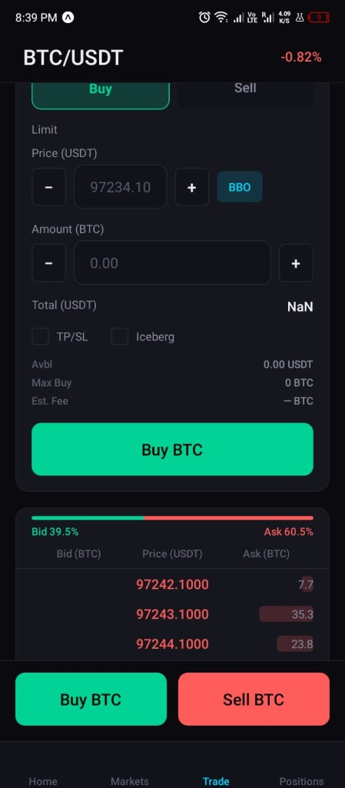
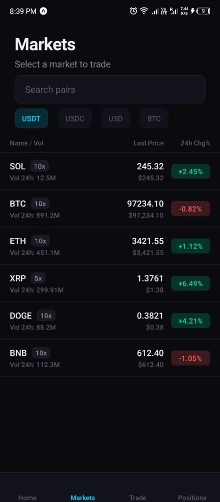
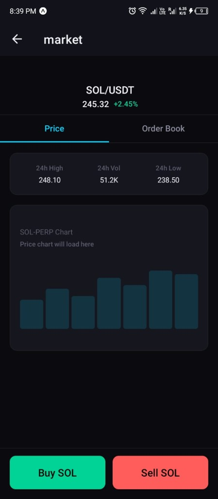
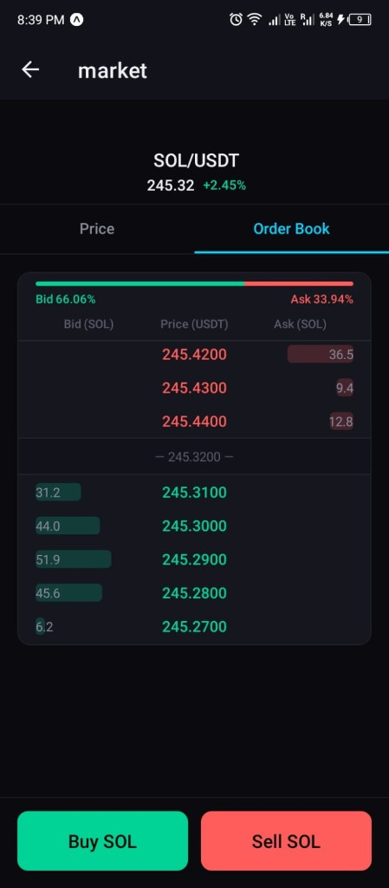

# Perp DEX Mobile

Mobile UI for the Perp DEX perpetual futures protocol. Connect your wallet and trade SOL-PERP, BTC-PERP, and other markets from your phone. **Expo + React Native only**—no Java, no native build step. Run with Expo Go on your phone or in the browser.

## Screenshots

| Trade screen | Markets list |
|--------------|--------------|
|  |  |

| [Market detail — Price](../docs/screenshots/market-detail-price.png) | [Market detail — Order book](../docs/screenshots/market-detail-orderbook.png) |
|-----------------------|----------------------------|
|  |  |

*Screenshots are in the repo at `docs/screenshots/` (relative to repo root).*

---

## How the mobile app works

The app is a **real-time trading client** that talks to the Perp DEX backend and on-chain program. Everything you see—markets, order book, balances, positions—comes from live chain data pushed over a WebSocket. Below is how each part fits together.

### 1. Backend and WebSocket indexer

Before using the app you run the **backend** (from repo root):

```bash
cd backend && npm install && npm run build
RPC_URL=https://api.devnet.solana.com npm start
```

The backend serves:

- **REST API** — `/api/config`, `/api/markets`, `/api/user/:pubkey`, `/api/orderbook/:symbol`, `/api/relay` (for submitting signed transactions).
- **WebSocket** at `/ws` — a single connection that streams **indexer state** to all connected clients.

The **indexer** (inside the backend) periodically polls Solana:

- Fetches all markets, request/event queue counts, and for each market the **order book** (bid/ask slab accounts).
- For each **subscribed user** (see below), fetches collateral and positions.

When state changes, the backend broadcasts one JSON message to every WebSocket client:

`{ type: 'state', payload: { markets, requestQueueCount, eventQueueCount, users, orderBooks } }`.

So the mobile app does **not** poll REST repeatedly; it stays on one WebSocket and receives one unified state object.

### 2. Mobile app entry and config

- **Expo Router** — File-based routing. Tabs live under `app/(tabs)/`: Home, Markets, Trade, Positions. Market detail is `app/market/[symbol].tsx`.
- **Root layout** (`app/_layout.tsx`) — Loads fonts, applies dark theme, and wraps the app in `WalletProvider` and **`IndexerProvider`**. The whole app is inside `IndexerProvider`, so any screen can use the indexer state.
- **Config** — `lib/solana/config.ts` exposes `getApiUrl()` and `getWsUrl()` (default: API host + `/ws`). On device/emulator you set `EXPO_PUBLIC_API_URL` (e.g. `http://192.168.1.32:3001`) so the phone reaches your machine.

### 3. IndexerContext and live state

`lib/solana/IndexerContext.tsx` is the bridge between the backend WebSocket and the UI.

- **Connection** — On mount, it opens a WebSocket to `getWsUrl()`. On each `state` message it updates React state with the full payload.
- **Subscribe user** — When the user “connects” a wallet, the app calls `subscribeUser(publicKey)`. That sends `{ type: 'subscribe_user', pubkey }` over the WebSocket. The backend then includes that user’s collateral and positions in every subsequent state push.
- **Exposed state** — `state` holds: `markets`, `requestQueueCount`, `eventQueueCount`, `users` (map of pubkey → collateral + positions), and **`orderBooks`** (map of symbol → `{ bids, asks, midPrice, bidPct, askPct }`).
- **Hooks** — `useIndexer()`, `useIndexerMarkets()`, `useIndexerUser(pubkey)`, `useIndexerQueues()`. These read from the same context; when the backend pushes a new state, all components using these hooks re-render with the latest data.

So: **one WebSocket, one state tree, all screens see the same live data.**

### 4. Screens and what they use

- **Home** (`app/(tabs)/index.tsx`) — Wallet connect (UI), portfolio summary. Uses indexer for user data when a wallet is connected.
- **Markets** (`app/(tabs)/markets.tsx`) — List of perpetual markets. Uses `useIndexerMarkets()` for live symbols and last prices; falls back to mock data if the indexer hasn’t loaded yet. Search and quote filters (USDT, USDC, etc.) are local. Tapping a row navigates to `market/[symbol]`.
- **Trade** (`app/(tabs)/trade.tsx`) — Single-market trading view:
  - **Order form** — Limit price, amount, Buy/Sell. **Available balance** comes from indexer user collateral. “Buy BTC” (or Sell) builds a place-order instruction and sends the signed transaction via backend `/api/relay`; the **request cranker** (running separately) picks it up from the on-chain request queue and processes it.
  - **Order book** — Reads `state.orderBooks[symbol]` from the indexer (same data the backend gets from the chain). Shows bid/ask distribution and top levels. If the indexer hasn’t sent that market’s book yet, it falls back to mock data.
  - **Holdings / Open orders** — Positions from indexer; open orders count is shown (orders list can be wired later).
  - **Queue indicator** — If `requestQueueCount > 0`, shows “Processing orders…”.
- **Positions** (`app/(tabs)/positions.tsx`) — All open positions from `useIndexerUser(publicKey)`.
- **Market detail** (`app/market/[symbol].tsx`) — Price tab (24h high/low/vol, chart placeholder) and **Order book** tab. Same `state.orderBooks[symbol]` as Trade; “Buy SOL” / “Sell SOL” navigate to Trade with that symbol.

So the **order book on mobile is the same as on-chain**: the backend parses the slab accounts, aggregates by price, and pushes the result in `orderBooks`; the app only displays it.

### 5. Order placement flow

1. User sets side, size, limit price and taps “Buy” or “Sell”.
2. **OrderForm** (and/or trade flow) uses **usePlaceOrder** (`hooks/usePerpDex.ts`) to build the `process_place_order` instruction with the correct PDAs (from program IDL and market/user).
3. The wallet (or mock) signs the transaction. The app sends the serialized transaction (base64) to **POST /api/relay**.
4. Backend calls `connection.sendRawTransaction(...)`. Once the tx is on-chain, it lands in the **request queue**.
5. The **request cranker** (separate process, see `crankers/`) sees request queue count &gt; 0 and calls the program’s crank instruction. The matching engine runs on-chain; results go to the **event queue**.
6. The **event cranker** processes the event queue and updates user positions. The next indexer tick will fetch updated order books and user state and push to the app—so the UI updates on the next WebSocket state message.

### 6. Theming and layout

- **Theme** — `constants/Theme.ts` and `Colors.ts`: background `#0a0a0f`, long/green `#00d395`, short/red `#ff5c5c`, accent `#00d4ff`. Used across all screens.
- **Order book** — `OrderBookDepth` component shows bids/asks with depth bars; bid/ask percentage bar at top (e.g. Bid 39.5% / Ask 60.5%).

### 7. Summary

| What you see           | Source |
|------------------------|--------|
| Markets list, last price | Backend indexer → `state.markets` |
| Order book (bids/asks) | Backend fetches slab accounts → `state.orderBooks[symbol]` |
| Your balance           | Backend fetches user collateral → `state.users[pubkey]` |
| Your positions         | Backend fetches position accounts → `state.users[pubkey].positions` |
| “Processing orders…”   | `state.requestQueueCount` from indexer |

The mobile app is a **thin client**: it displays whatever the backend puts in the indexer state and sends orders through the backend relay. The backend and crankers do the RPC and chain interaction; the app stays in sync via a single WebSocket.

---

## Stack

- **Expo SDK 54** (React Native) with **Expo Router** (file-based tabs)
- **TypeScript**
- Dark trading theme (long/short colors, order book depth)

## Run

```bash
cd perp-mobile
npm install
npx expo start
```

- **Web**: press `w` to open in the browser.
- **Phone (Expo Go)**: install [Expo Go](https://expo.dev/go), then scan the QR code. Use **Expo SDK 54** to match the store app.

On device/emulator, set the API base URL so the app reaches your backend, e.g. in `.env`:

```
EXPO_PUBLIC_API_URL=http://192.168.1.32:3001
EXPO_PUBLIC_RPC_URL=https://api.devnet.solana.com
```

Wallet connection is wired for Solana; the UI uses a mock pubkey until you integrate a real wallet (e.g. Phantom deep link or WalletConnect). Placing an order requires a wallet that can sign; the context accepts a `signTransaction` callback when you plug in an adapter.

## Project layout

```
app/
  (tabs)/
    index.tsx      # Home + wallet connect
    markets.tsx    # Markets list (live from indexer)
    trade.tsx      # Trade view + order form + order book
    positions.tsx  # Open positions
  market/
    [symbol].tsx   # Market detail (Price + Order book tabs)
lib/
  solana/
    config.ts      # getApiUrl(), getWsUrl()
    IndexerContext.tsx  # WebSocket indexer state + subscribeUser
    WalletContext.tsx
    ...
hooks/
  usePerpDex.ts    # useApiMarkets, useApiUser, usePlaceOrder
components/
  WalletButton.tsx
  MarketCard.tsx
  PositionCard.tsx
  OrderForm.tsx
  OrderBookDepth.tsx
  StickyBuySell.tsx
  ...
constants/
  Theme.ts
  Colors.ts
  mockData.ts
```

## Theming

- **Background**: `#0a0a0f`
- **Long**: `#00d395`
- **Short**: `#ff5c5c`
- **Accent**: `#00d4ff`

All defined in `constants/Theme.ts`.
